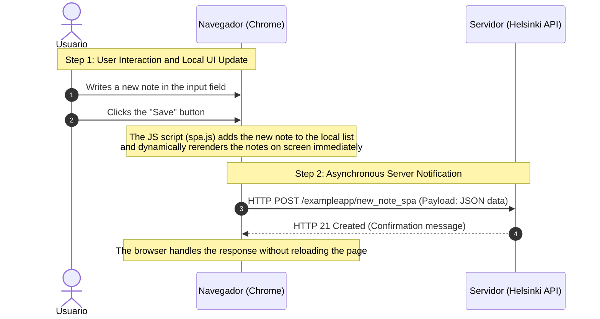

```mermaid
sequenceDiagram
    autonumber
    actor Usuario
    participant Navegador as Navegador (Chrome)
    participant Servidor as Servidor (Helsinki API)

    Note over Usuario,Navegador: Step 1: User Interaction and Local UI Update
    Usuario->>Navegador: Writes a new note in the input field
    Usuario->>Navegador: Clicks the "Save" button
    Note over Navegador: The JS script (spa.js) adds the new note to the local list<br/>and dynamically rerenders the notes on screen immediately

    Note over Navegador,Servidor: Step 2: Asynchronous Server Notification
    Navegador->>Servidor: HTTP POST /exampleapp/new_note_spa (Payload: JSON data)
    Servidor-->>Navegador: HTTP 21 Created (Confirmation message)
    Note over Navegador: The browser handles the response without reloading the page
```